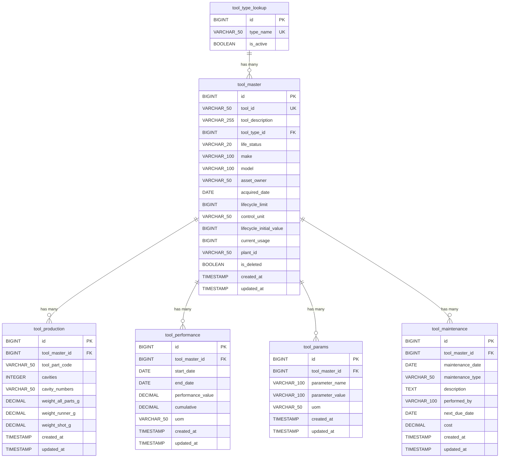

```mermaid
erDiagram
    tool_type_lookup {
        BIGINT id PK
        VARCHAR_50 type_name UK
        BOOLEAN is_active
    }

    tool_master {
        BIGINT id PK
        VARCHAR_50 tool_id UK
        VARCHAR_255 tool_description
        BIGINT tool_type_id FK
        VARCHAR_20 life_status
        VARCHAR_100 make
        VARCHAR_100 model
        VARCHAR_50 asset_owner
        DATE acquired_date
        BIGINT lifecycle_limit
        VARCHAR_50 control_unit
        BIGINT lifecycle_initial_value
        BIGINT current_usage
        VARCHAR_50 plant_id
        BOOLEAN is_deleted
        TIMESTAMP created_at
        TIMESTAMP updated_at
    }

    tool_production {
        BIGINT id PK
        BIGINT tool_master_id FK
        VARCHAR_50 tool_part_code
        INTEGER cavities
        VARCHAR_50 cavity_numbers
        DECIMAL weight_all_parts_g
        DECIMAL weight_runner_g
        DECIMAL weight_shot_g
        TIMESTAMP created_at
        TIMESTAMP updated_at
    }

    tool_performance {
        BIGINT id PK
        BIGINT tool_master_id FK
        DATE start_date
        DATE end_date
        DECIMAL performance_value
        DECIMAL cumulative
        VARCHAR_50 uom
        TIMESTAMP created_at
        TIMESTAMP updated_at
    }

    tool_params {
        BIGINT id PK
        BIGINT tool_master_id FK
        VARCHAR_100 parameter_name
        VARCHAR_100 parameter_value
        VARCHAR_50 uom
        TIMESTAMP created_at
        TIMESTAMP updated_at
    }

    tool_maintenance {
        BIGINT id PK
        BIGINT tool_master_id FK
        DATE maintenance_date
        VARCHAR_50 maintenance_type
        TEXT description
        VARCHAR_100 performed_by
        DATE next_due_date
        DECIMAL cost
        TIMESTAMP created_at
        TIMESTAMP updated_at
    }

    tool_type_lookup ||--o{ tool_master : "has many"
    tool_master ||--o{ tool_production : "has many"
    tool_master ||--o{ tool_performance : "has many"
    tool_master ||--o{ tool_params : "has many"
    tool_master ||--o{ tool_maintenance : "has many"
```
